# Next.js → React + Vite + TanStack Router 마이그레이션 설계서

- **작성일**: 2026-05-09
- **대상 저장소**: `react-bootstrap`
- **마이그레이션 출발점**: `temp/` (Next.js 15 App Router 기반 부트스트랩)
- **마이그레이션 도착점**: 루트 (Vite + React 19 + TanStack Router file-based 라우팅)
- **패키지 매니저**: pnpm 10
- **마이그레이션 전략**: B안 — shadcn 재초기화 후 자체 코드 이전

---

## 1. 배경과 목표

`temp/` 에는 Next.js 15 App Router 기반의 인증/모달/Tailwind v3 부트스트랩이 들어 있다. 이를 동일 저장소 루트에 React + Vite 프로젝트로 재구성하면서 다음을 만족시킨다.

- **No SSR**: Vite 클라이언트 SPA. Next.js 의존성과 `'use client'` 는 전부 제거.
- **TanStack Router (file-based)**: `@tanstack/router-plugin/vite` 가 `src/routes/` 를 스캔해 `routeTree.gen.ts` 자동 생성.
- **Tailwind v4**: CSS-first. `tailwind.config.ts` 폐기, `globals.css` 의 `@theme` 블록으로 토큰 노출.
- **shadcn 재초기화**: shadcn CLI(`pnpm dlx shadcn@latest`) 로 컴포넌트를 v4 표준 명명규칙으로 재설치. `style: "base-nova"`, `baseColor: "neutral"`, `iconLibrary: "lucide"` 유지.
- **자체 코드 보존**: `features/auth/*`, `stores/*`, `hooks/*`, `components/ui/modal/*`, `components/layout/*` 는 Next.js 의존 부분만 패치 후 그대로 이전.
- **pnpm only**: npm 사용 금지. `packageManager: "pnpm@10.x"` 명시.

비목표(이번 작업에서 다루지 않음): SSR/SSG, 다크 모드 토글 UI, 인증 보호 라우트 가드, e2e 테스트, CI 설정, 시각 회귀 테스트.

---

## 2. 최종 디렉토리 구조

```
react-bootstrap/
├── index.html
├── package.json
├── pnpm-lock.yaml
├── pnpm-workspace.yaml          # onlyBuiltDependencies 정책
├── .pnpm-build-policy.json      # temp 에서 이전
├── vite.config.ts
├── tsconfig.json
├── tsconfig.node.json
├── biome.json                   # temp 에서 이전
├── components.json              # rsc:false 로 패치
├── README.md, PRD.md            # temp 에서 이전
├── docs/                        # temp 에서 이전
└── src/
    ├── main.tsx                 # createRouter + RouterProvider
    ├── styles/globals.css       # Tailwind v4 + @theme
    ├── routes/                  # file-based, 자동 생성된 routeTree.gen.ts 동거
    │   ├── __root.tsx           # Providers + Outlet + Modals + Toaster + DevTools
    │   ├── index.tsx            # 기존 app/page.tsx
    │   ├── auth/
    │   │   ├── login.tsx
    │   │   └── signup.tsx
    │   └── test/
    │       └── modal.tsx
    ├── lib/
    │   ├── utils.ts
    │   └── router.ts            # createRouter + declare module Register
    ├── providers/
    │   └── app-providers.tsx    # QueryClientProvider
    ├── components/
    │   ├── ui/                  # shadcn CLI 재설치
    │   │   └── modal/           # 자체 모달 매니저 그대로
    │   └── layout/
    │       └── auth-shell.tsx
    ├── features/
    │   └── auth/                # next/* 패치 후 그대로
    ├── stores/
    └── hooks/
```

### 2.1 라우트 매핑

| Next.js (App Router) | TanStack Router file-based |
|---|---|
| `app/layout.tsx` + `app/providers.tsx` | `routes/__root.tsx` |
| `app/page.tsx` | `routes/index.tsx` |
| `app/auth/login/page.tsx` | `routes/auth/login.tsx` |
| `app/auth/signup/page.tsx` | `routes/auth/signup.tsx` |
| `app/test/modal/page.tsx` | `routes/test/modal.tsx` |

`AuthShell` 은 layout 라우트(`_layout.tsx`)로 승격하지 않고, login/signup 이 각자 직접 사용하는 현 구조를 유지한다 — props (title/subtitle) 가 페이지마다 달라 layout 라우트로 묶을 때 props drilling 또는 useMatches 노이즈가 생긴다.

---

## 3. 의존성 변경

### 3.1 추가

| 패키지 | 종류 | 용도 |
|---|---|---|
| `vite` | dev | 빌드/개발 서버 |
| `@vitejs/plugin-react` | dev | React 변환 |
| `@tanstack/react-router` | runtime | 라우터 |
| `@tanstack/router-plugin` | dev | file-based 자동 생성 |
| `@tanstack/router-devtools` | dev | 라우터 디버깅 |
| `@tailwindcss/vite` | dev | Tailwind v4 Vite 통합 |
| `tailwindcss` (^4) | dev | v4 본체 |
| `vite-tsconfig-paths` | dev | `@/*` alias 해결 |
| `@fontsource-variable/inter` | runtime | Inter 폰트 (CDN 제거) |

### 3.2 제거

| 패키지 | 이유 |
|---|---|
| `next` | 프레임워크 교체 |
| `next-themes` | ThemeProvider 미사용. `sonner.tsx` 의 `useTheme` 만 호출하므로 단순화 가능 |
| `autoprefixer` | Tailwind v4 가 자체 처리 |
| `postcss` | v4 는 PostCSS 불필요 |
| `shadcn` (dependency) | CLI 는 `pnpm dlx` 호출. 고정할 이유 없음 |

### 3.3 유지 (변경 없음)

`@base-ui/react`, `@hookform/resolvers`, `@radix-ui/*`, `@tanstack/react-query`, `class-variance-authority`, `clsx`, `date-fns`, `immer`, `lucide-react`, `motion`, `react-day-picker`, `react-focus-lock`, `react-hook-form`, `sonner`, `tailwind-merge`, `tw-animate-css`, `zod`, `zustand`, `@biomejs/biome`, React 19, React DOM 19.

### 3.4 코드 패치 지점 (총 7개 import + 25개 `'use client'`)

| 파일 | 변경 |
|---|---|
| `app/page.tsx` | `next/link` Link → `@tanstack/react-router` Link (`href` → `to`) |
| `app/auth/login/page.tsx` | 동일 |
| `app/auth/signup/page.tsx` | 동일 |
| `app/layout.tsx` | 통째로 `routes/__root.tsx` 로 재작성. `next/font/google` Inter → `@fontsource-variable/inter` |
| `features/auth/hooks/use-auth-mutation.ts` | `useRouter().push(x)` → `useNavigate()({ to: x })` |
| `components/ui/sonner.tsx` | `useTheme from 'next-themes'` 제거. `theme="system"` 하드코딩 |
| 모든 `'use client'` 25개 라인 | 일괄 삭제 |

### 3.5 globals.css v4 골자

```css
@import "tailwindcss";
@import "tw-animate-css";
@custom-variant dark (&:is(.dark *));

@theme inline {
  --color-background: var(--background);
  --color-foreground: var(--foreground);
  --color-card: var(--card);
  --color-card-foreground: var(--card-foreground);
  /* ... shadcn 토큰을 v4 @theme 매핑으로 일괄 노출 ... */
  --radius-lg: var(--radius);
  --radius-md: calc(var(--radius) - 2px);
  --radius-sm: calc(var(--radius) - 4px);
}

:root { /* oklch 토큰들 그대로 */ }
.dark { /* 다크 토큰들 그대로 */ }
```

`tailwind.config.ts` 는 삭제한다.

---

## 4. 마이그레이션 실행 단계

각 Step 이 1 커밋. 이전 단계 검증 통과 후에만 다음 단계 진입.

흐름은 다음 순서로 진행한다. Step 0 은 안전망일 뿐 별도 작업이 없고, Step 1~6 이 실제 변환 작업이다. 마지막 Step 6 에서 `temp/` 를 제거하기 전까지는 모든 단계에서 `temp/` 를 참조 자료로 사용할 수 있다.

```mermaid
flowchart LR
  S0([Step 0<br/>temp 보존]) --> S1[Step 1<br/>Vite 골격]
  S1 --> S2[Step 2<br/>Tailwind v4 + globals]
  S2 --> S3[Step 3<br/>shadcn 재초기화]
  S3 --> S4[Step 4<br/>자체 코드 이전]
  S4 --> S5[Step 5<br/>라우트 재배치]
  S5 --> S6[Step 6<br/>부속 자산 + temp 제거]
  S6 --> DONE([DoD 충족])

  classDef bootstrap fill:#dbeafe,stroke:#2563eb,color:#1e3a8a;
  classDef migrate fill:#fef3c7,stroke:#d97706,color:#78350f;
  classDef cleanup fill:#dcfce7,stroke:#16a34a,color:#14532d;
  classDef terminal fill:#e9d5ff,stroke:#7c3aed,color:#4c1d95;

  class S0 terminal;
  class S1,S2 bootstrap;
  class S3,S4,S5 migrate;
  class S6 cleanup;
  class DONE terminal;
```



### Step 1 — Vite 골격 생성
- 루트에 `package.json`, `vite.config.ts`, `tsconfig.json`, `tsconfig.node.json`, `index.html`, `src/main.tsx`, `src/lib/router.ts`, 빈 `src/routes/__root.tsx`, 빈 `src/routes/index.tsx`
- `pnpm install` → `pnpm dev` 가 빈 페이지 200 응답
- **검증**: dev 서버 기동 성공

### Step 2 — Tailwind v4 + globals.css
- `src/styles/globals.css` 작성 (위 골자 적용, oklch 토큰은 temp 의 globals.css 그대로 복사)
- `main.tsx` 에 `import './styles/globals.css'`, `import '@fontsource-variable/inter'`
- `index.html` body 에 `font-sans antialiased`
- **검증**: 임시 Tailwind 클래스가 적용된 div 가 렌더

### Step 3 — shadcn CLI 재초기화
- `components.json` 작성 (rsc: **false**, tsx: true, style: `base-nova`, baseColor: `neutral`, css: `src/styles/globals.css`, cssVariables: true, iconLibrary: `lucide`, alias 동일)
- 컴포넌트 일괄 설치:
  ```
  pnpm dlx shadcn@latest add button card input label form dialog \
    alert alert-dialog accordion badge calendar pagination progress \
    radio-group scroll-area select skeleton sonner switch tabs
  ```
- 자체 코드(아래 Step 4 에서 이전): `string-to-html.tsx`, `modal/` 7개 파일은 shadcn 영역이 아님
- **검증**: `pnpm tsc --noEmit` 0 에러

### Step 4 — 자체 코드 이전
다음을 temp → 새 src 로 복사 후 next/* import 패치.

| temp 경로 | 새 경로 |
|---|---|
| `temp/src/lib/utils.ts` | `src/lib/utils.ts` |
| `temp/src/hooks/use-mobile.ts` | `src/hooks/use-mobile.ts` |
| `temp/src/stores/` | `src/stores/` |
| `temp/src/components/layout/auth-shell.tsx` | `src/components/layout/auth-shell.tsx` |
| `temp/src/components/ui/modal/` | `src/components/ui/modal/` |
| `temp/src/components/ui/string-to-html.tsx` | `src/components/ui/string-to-html.tsx` |
| `temp/src/features/auth/` | `src/features/auth/` |

각 파일에 다음 변환을 적용한다.
- `'use client'` 라인 제거
- `from 'next/link'` → `from '@tanstack/react-router'` (Link `href` → `to`)
- `from 'next/navigation'` → `from '@tanstack/react-router'` (`useRouter().push(x)` → `useNavigate()({ to: x })`)
- `sonner.tsx` 의 `useTheme` 호출 제거

**검증**: `pnpm tsc --noEmit` 0 에러

### Step 5 — 라우트 재배치
- `app/page.tsx` → `routes/index.tsx`
- `app/auth/login/page.tsx` → `routes/auth/login.tsx`
- `app/auth/signup/page.tsx` → `routes/auth/signup.tsx`
- `app/test/modal/page.tsx` → `routes/test/modal.tsx`

각 파일 상단에 `createFileRoute` boilerplate 추가:
```ts
import { createFileRoute } from '@tanstack/react-router'
export const Route = createFileRoute('/auth/login')({ component: LoginPage })
```

`routes/__root.tsx` 에 Providers + Outlet + Modals + Toaster 통합. `import.meta.env.DEV` 가드로 router devtools 마운트.

**검증**: 4개 라우트 수동 클릭 + 콘솔 에러 0

### Step 6 — 부속 자산 이전 + temp 제거
- `temp/PRD.md` → `PRD.md`
- `temp/README.md` → `README.md` (Vite 기준 재작성)
- `temp/docs/` → `docs/`
- `temp/biome.json` → `biome.json`
- `temp/.pnpm-build-policy.json` → 루트
- `rm -rf temp/`
- `.gitignore` 갱신: `node_modules`, `dist`, `src/routeTree.gen.ts`

**검증**: `pnpm build` 성공 + `pnpm preview` 정상

### 4.1 검증 게이트 요약

| Step | 검증 명령 | 통과 조건 |
|---|---|---|
| 1 | `pnpm dev` | 빈 페이지 200 응답 |
| 2 | 브라우저 수동 | tailwind 유틸 적용 |
| 3 | `pnpm tsc --noEmit` | 0 에러 |
| 4 | `pnpm tsc --noEmit` | 0 에러 |
| 5 | 브라우저 수동 | 4개 라우트 + 로그인 mock 동작 |
| 6 | `pnpm build && pnpm preview` | 빌드 성공, preview 동작 |

---

## 5. 테스트 전략

이 작업은 도구 교체이며 새 비즈니스 로직이 없다. 단위/통합 테스트를 신규 작성하지 않는다. 대신 **기존 동작 보존 검증** 에 집중한다.

| 검증 유형 | 도구 | 범위 |
|---|---|---|
| 정적 타입 | `pnpm tsc --noEmit` | src 전체 |
| 린트 | `pnpm biome check .` | src 전체 |
| 빌드 | `pnpm build` | dist 산출 |
| 수동 회귀 | 브라우저 | 라우트 4개 + 폼 |

### 5.1 수동 회귀 시나리오

1. `/` — 비로그인 시 "로그인", "회원가입" 버튼 노출 → 클릭 시 라우팅
2. `/auth/login` — 잘못된 입력 시 zod validation 에러 표시
3. `/auth/login` — `mockLogin` 성공 시 `/` 로 이동
4. `/auth/signup` — 가입 성공 시 sonner toast "가입이 완료되었습니다!" + `/auth/login` 으로 이동
5. `/` — 로그인 후 user.email 표시 + "로그아웃" 클릭 시 상태 초기화
6. `/test/modal` — 모달 열기/닫기, 백드롭 클릭, ESC 키 닫기
7. 새로고침 시 zustand persist 복원 (사용 중이라면)

---

## 6. 완료 정의 (DoD)

- [ ] 루트에 Vite 기반 `package.json`, `vite.config.ts`, `tsconfig.json`, `index.html`, `src/` 존재
- [ ] `pnpm install` 후 lockfile 생성, `node_modules` 정상
- [ ] `pnpm dev` 기동 후 4개 라우트 모두 200 + 콘솔 에러 0
- [ ] `pnpm build` 성공 + `dist/` 산출
- [ ] `pnpm preview` 정상 동작
- [ ] `pnpm tsc --noEmit` 0 에러
- [ ] `pnpm biome check .` 0 에러 (warning 허용)
- [ ] `temp/` 디렉토리 제거 완료
- [ ] `next`, `next-themes`, `autoprefixer`, `postcss` 가 의존성에 없음
- [ ] `grep -r "next/" src/` 0건, `grep -r "'use client'" src/` 0건
- [ ] 수동 회귀 시나리오 1~7 모두 정상
- [ ] `src/routeTree.gen.ts` 가 `.gitignore` 에 포함

---

## 7. 리스크와 완화

| 리스크 | 신뢰 | 완화 |
|---|---|---|
| `base-nova` 스타일이 shadcn registry 에 없거나 변경 | 중간 | `style: "new-york"` 으로 fallback. 색상은 oklch 그대로라 시각 차이 미미 |
| Tailwind v4 와 일부 Radix UI portal 클래스 충돌 | 낮음 | 모달 매니저는 자체 z-index. 발견 시 `@layer utilities` 패치 |
| `tw-animate-css` v4 호환 | 낮음 | 1.4.0 은 v4 지원 |
| `routeTree.gen.ts` 누락으로 첫 build 실패 | 낮음 | dev 한 번 기동 후 build. CI 에 dev pre-build 스텝 명시 |
| Inter 폰트 fallback chain 에서 픽셀 단위 차이 | 낮음 | `@fontsource-variable/inter` 로 동일 폰트 보장 |

---

## 8. 롤백 전략

각 Step 이 단일 커밋이므로 `git reset --hard <prev-commit>` 으로 즉시 되돌릴 수 있다. Step 6 (temp 제거) 이전까지는 `temp/` 가 그대로 있어 참조 자료로 쓸 수 있다. Step 6 이 실패하면 temp 복구는 git history 에서 가능.

---

## 9. 비범위

이번 마이그레이션에서 **하지 않는 것**:

- SSR/SSG 도입 (TanStack Start 등)
- 다크 모드 토글 UI 추가 (next-themes 제거 후 재구축은 별도 작업)
- 인증 보호 라우트 가드 (`beforeLoad` 패턴)
- e2e 테스트 (Playwright/Cypress) 신규 도입
- shadcn 컴포넌트 시각 회귀 테스트
- CI 설정 (GitHub Actions 등)
- monorepo / workspace 분리 (현 단일 패키지 유지)
